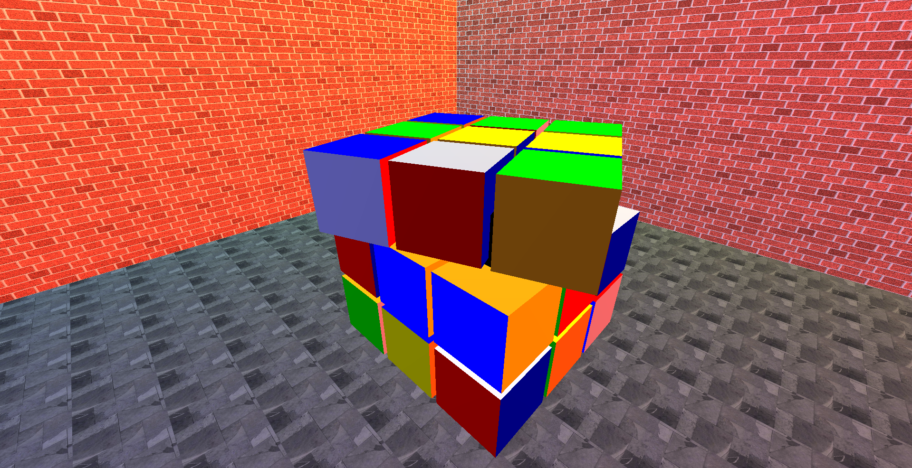

# Rubik's Cube on Qt with GLSL

Desktop application on the Qt framework. Implementation of the Rubik's Cube using shaders.

There are wrapper classes here that you can use to create your own 3D objects and place them on the scene

Examples:

